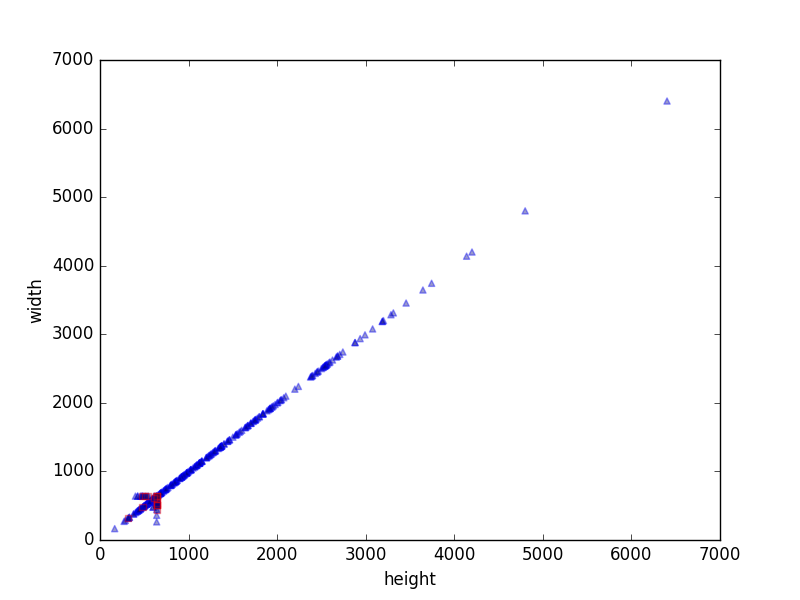
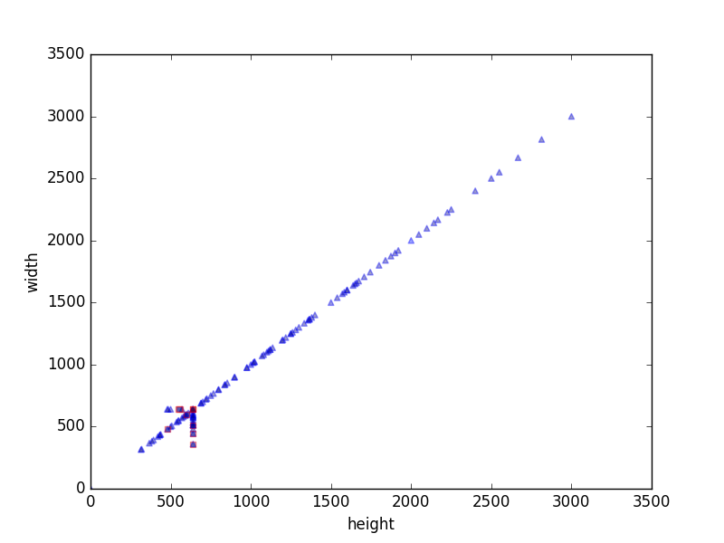

# Gender Divide

The future is non-binary, but for now let's say it is to make things easier...

# Plan

1. Examine dataset by hand. Look for structure, mislabels, formats, etc.
2. Create image processing pipeline (resizing, downsampling, etc.).
3. Naive model implementation to use as baseline: Not-too-deep CNN w/ softmax.
4. Examine mislabeled items by hand.
5. Adjust for mislabelings (e.g. find person or not, and classify people on male/female).
6. Test data augmentation.
7. Avoid impulse to fine-tune model.
8. Make presentation.

# Requirements

- Keras
- Tensorflow
- OpenCV

# Installation

Assuming Ubuntu and root priviledges:

    apt-get install python-pip zip hdf5
    pip install keras
    pip install tensorflow
    pip install opencv-python
    pip install h5py

Data is found at https://storage.cloud.google.com/fw-share/20170803-fw-gender-classification-data.zip. Assuming it is downloaded and in the root directory:

    unzip 20170803-fw-gender-classification-data.zip
    mv data-v2 data

Finally to reorganize data and create directory structure:

    python setup.py

# Dataset

## Description

Upon first look, the dataset consists of two directories of images (ones labelled male and female). The images are all square of varying resolution and contain anything for single clothing items to full scenes with people. Some images are clearly mislabeled (~ 1 in 30).

## Statistics

Counts are grabbed from the JSON metadata files. We found a single duplicate in the female training set. Other than that, all files are accounted for.

| Gender | Train | Test | Total |
| ------ | ----- | ---- | ----- |
| Female | 2664  | 370  | 3034  |
| Male   | 692   | 97   | 789   |

Resolutions are determined via Python's OpenCV wrapper. We plot them here:

### Female

### Male

# Models

## NaiveCNN

To train:

    python train.py naive_cnn

To evaluate:

    python evaluate.py naive_cnn

## VGG16

### Top layer only

To train:

    python train.py vgg16

To evaluate:

    python evaluate.py vgg16

### Top layer and last CNN layer

# Extensions

- pre-classification into people and objects
- ensembling
  - multiple models
  - multiple inputs from same input (via data augmentation)
- knobs:
  - data augmentation (rotation, zoom, channel shifts, etc.)
  - dropout
  - regularization
  - resolution
- more data
  - amazon data
  - other web scraping (e.g. google images)
